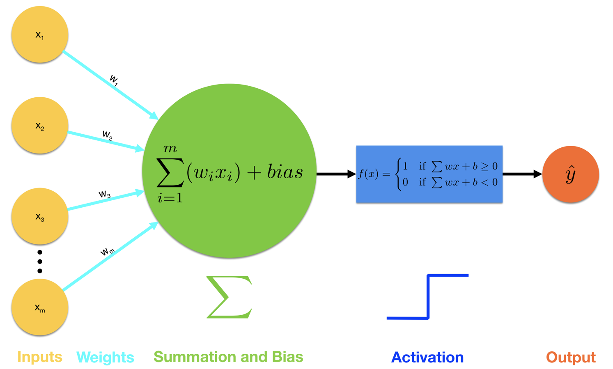

# Learning Objectives

- What is Neural network

- We learn Forward and backward propagation in NN

- We implement a NN entirely in numpy

## What is Neural Network?

It is a computational system inspired by the Structure, Processing Method and Learning Ability similar to our biological brain

### Characteristics of Artificial Neural Networks

- A large number of very simple processing neuron-like processing elements

- A large number of weighted connections between the elements

- Distributed representation of knowledge over the connections

- Knowledge is acquired by network through a learning process

### What is perceptron?

- A perceptron can be understood as anything that takes multiple inputs and produces one output



### Multi-layer perceptron (MLP)

- MLP is the stack of perceptrons


- In this image, the yellow nodes are inputs, the blue nodes (at each vertical) are hidden layers and the orange ones are output of the MLP

### Forward and backward propagation

NN takes several input, processes it through multiple neurons from multiple hidden layers and returns the result using an output layer. This result estimation process is technically known as “***Forward Propagation***“

Next, we compare the result with actual output. The task is to make the output to neural network as close to actual (desired) output. This defines our cost function.

We try to obtain the weight of neurons such that the NN total error (our cost function) being minimized. This process is known as “***Backward Propagation***“

### Activity: Implementing NN using Numpy

- Assume, we want to build and train (obtain the weights) of a MLP such that for the given input: `X=np.array([[1,0,1,0],[1,0,1,1],[0,1,0,1]])`

- gives us this desire output: `y=np.array([[1],[1],[0]])`

- Also, assume we have only one hidden layer with three neurons and activation function for each perceptron is sigmoid

```python

import numpy as np

# check this out:
# https://www.analyticsvidhya.com/blog/2017/05/neural-network-from-scratch-in-python-and-r/
# Input array
X=np.array([[1,0,1,0],[1,0,1,1],[0,1,0,1]])

#Output
y=np.array([[1],[1],[0]])


#Sigmoid Function
def sigmoid (x):
    return 1/(1 + np.exp(-x))


#Derivative of Sigmoid Function
def derivatives_sigmoid(x):
    return x * (1 - x)


#Variable initialization
epoch=5000 #Setting training iterations
lr=0.1 #Setting learning rate
inputlayer_neurons = X.shape[1] #number of features in data set
hiddenlayer_neurons = 3 #number of hidden layers neurons
output_neurons = 1 #number of neurons at output layer

#weight and bias initialization
wh=np.random.uniform(size=(inputlayer_neurons,hiddenlayer_neurons))
bh=np.random.uniform(size=(1,hiddenlayer_neurons))
wout=np.random.uniform(size=(hiddenlayer_neurons,output_neurons))
bout=np.random.uniform(size=(1,output_neurons))


for i in range(epoch):
    #Forward Propogation
    hidden_layer_input1=np.dot(X,wh)
    hidden_layer_input=hidden_layer_input1 + bh
    hiddenlayer_activations = sigmoid(hidden_layer_input)
    output_layer_input1=np.dot(hiddenlayer_activations,wout)
    output_layer_input= output_layer_input1+ bout
    output = sigmoid(output_layer_input)

    #Backpropagation
    D = y-output
    slope_output_layer = derivatives_sigmoid(output)
    slope_hidden_layer = derivatives_sigmoid(hiddenlayer_activations)
    d_output = D * slope_output_layer
    Error_at_hidden_layer = d_output.dot(wout.T)
    d_hiddenlayer = Error_at_hidden_layer * slope_hidden_layer
    wout += hiddenlayer_activations.T.dot(d_output) *lr
    bout += np.sum(d_output, axis=0,keepdims=True) *lr
    wh += X.T.dot(d_hiddenlayer) *lr
    bh += np.sum(d_hiddenlayer, axis=0,keepdims=True) *lr

print(output)
```

### How do we update the weights to minimize the error?

First we should define the cost function. for our example here the MSE is our cost function:

$E= \frac{1}{2} ({\bf y}_t - {\bf y}_p)^T ({\bf y}_t - {\bf y}_p)$

We update the weight (${\bf W}_i$ and ${\bf W}_h$) such that the error, $E$, being minimized. The most popular algorithm is Gradient Descent:  

${\bf W}_h = {\bf W}_h + \eta {\partial E}/{\partial {\bf W}_h} $

For our above example we can show that:

${\partial E}/{\partial {\bf W}_h} =  ({\bf y}_t - {\bf y}_p) {\bf y}_p (1 - {\bf y}_p)\bf {h}$

where ${\bf h} = \sigma({\bf W}_i {\bf x}_i + {\bf b}_i)$

In above code:

$D = {\bf y}_t - {\bf y}_p$

${\bf y}_p (1 - {\bf y}_p)$ = `slope_hidden_layer`

$\bf {h}$ = `hiddenlayer_activations`

## Other Resources:
- https://enlight.nyc/projects/neural-network/
